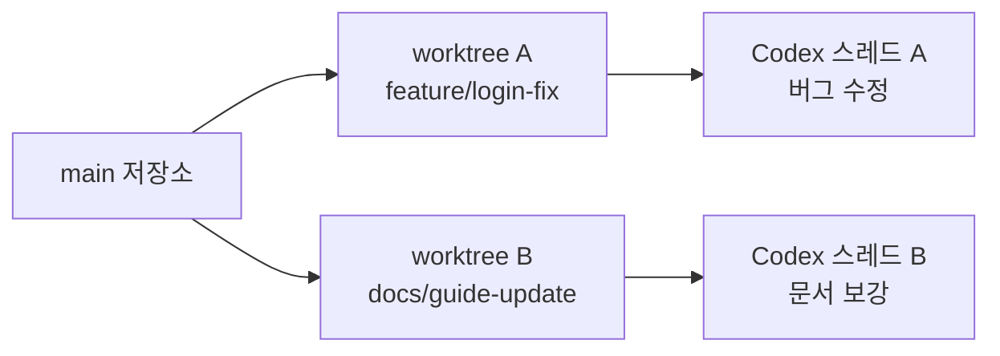

# 4-2. Codex app과 worktree 기반 병렬 작업

작업이 커지면 한 세션에서 모든 것을 처리하는 방식이 비효율적이 됩니다. 하나의 버그를 추적하는 동안 다른 기능 초안을 병렬로 만들고 싶을 수 있고, 문서화 작업과 코드 수정 작업을 분리하고 싶을 수도 있습니다. 이때 유용한 도구가 Codex app과 Git worktree입니다.

## 목차

- 스레드 병렬화
- worktree로 작업 분리하기
- 앱 안에서 diff·stage·commit 다루기
- 여러 작업을 동시에 굴리는 방법
- 실전 분리 예시
- 자주 하는 실수
- 정리

## 스레드 병렬화

스레드 병렬화의 핵심은 대화를 나누는 것이 아니라 작업 단위를 분리하는 것입니다. 하나의 스레드는 하나의 목표를 가져야 합니다. 탐색 스레드, 구현 스레드, 리뷰 스레드가 섞이면 문맥이 오염되고 판단이 흐려집니다.

Codex app의 장점은 이런 작업 단위를 시각적으로 분리하고, 서로 다른 흐름을 유지하기 쉽게 해준다는 점입니다.

## worktree로 작업 분리하기

Git worktree는 병렬 작업에서 매우 실용적입니다. 서로 다른 브랜치를 별도 디렉터리로 분리해 동시에 열어둘 수 있기 때문입니다. 실무에서 특히 유용한 경우는 다음과 같습니다.

- 메인 기능 작업과 문서화 작업을 분리할 때
- 버그 수정과 실험 브랜치를 병렬로 유지할 때
- PR 리뷰 대응과 신규 기능 작업을 동시에 할 때

worktree를 쓰면 "한 저장소에서 브랜치를 자꾸 바꾸다가 컨텍스트가 꼬이는 문제"를 크게 줄일 수 있습니다.

핵심은 브랜치만 나누는 것이 아니라 작업 문맥까지 함께 분리하는 것입니다. worktree와 스레드가 1:1로 대응될수록 충돌 가능성이 낮아집니다.

## 앱 안에서 diff·stage·commit 다루기

Codex app은 단순히 대화창이 아니라 작업 상태를 보는 인터페이스에 가깝습니다. 어떤 파일이 바뀌었는지, diff가 어떤지, 지금 커밋해도 되는 범위인지 판단하는 흐름을 한곳에서 유지할 수 있습니다.

병렬 작업에서는 이 점이 중요합니다. 여러 작업이 동시에 진행될 때 가장 위험한 것은 파일이 섞여 커밋 범위가 흐려지는 상황입니다. diff와 stage를 자주 확인하는 습관이 병렬 작업의 품질을 좌우합니다.

## 여러 작업을 동시에 굴리는 방법

병렬 작업은 속도를 올려주지만, 무작정 늘리면 오히려 관리 비용이 커집니다. 좋은 기준은 다음과 같습니다.

- 즉시 결과가 필요한 작업은 로컬에서 직접 처리합니다.
- 오래 걸리지만 독립적인 작업은 별도 스레드나 worktree로 분리합니다.
- 같은 파일을 동시에 많이 건드리는 작업은 병렬화하지 않습니다.

즉, 병렬화의 기준은 작업 개수보다 충돌 가능성과 통합 비용입니다.

## 실전 분리 예시

예를 들어 로그인 버그 수정과 책 문서 보강을 동시에 진행한다고 가정해보겠습니다.

- `worktree-a`: `fix/login-null-check`
- `worktree-b`: `docs/chapter-03-revision`

이 경우 좋은 분리는 다음과 같습니다.

- 버그 수정 스레드는 재현, 수정, 테스트에만 집중합니다.
- 문서 스레드는 설명 보강, 예시 추가, 이미지 계획 정리에만 집중합니다.
- 두 작업이 같은 파일을 건드리지 않도록 범위를 명시합니다.

반대로 나쁜 분리는 하나의 worktree에서 버그 수정, README 정리, 테스트 리팩터링을 한꺼번에 돌리는 방식입니다. 이렇게 되면 속도는 빨라 보여도 커밋 경계와 diff 검토 비용이 급격히 나빠집니다.

## 자주 하는 실수

- 서로 다른 목적의 작업을 같은 스레드에 섞습니다.
- worktree는 나눴지만 브랜치 목적을 명확히 적지 않습니다.
- 같은 파일을 여러 worktree에서 동시에 수정합니다.
- 병렬 작업을 늘린 뒤 통합 순서를 미리 정하지 않습니다.

## 정리

Codex app과 worktree는 "더 많이 동시에 하기" 위한 도구가 아니라, "덜 섞이게 일하기" 위한 도구입니다. 병렬 작업의 성공 여부는 속도보다도 충돌 없는 분리에 달려 있습니다.
