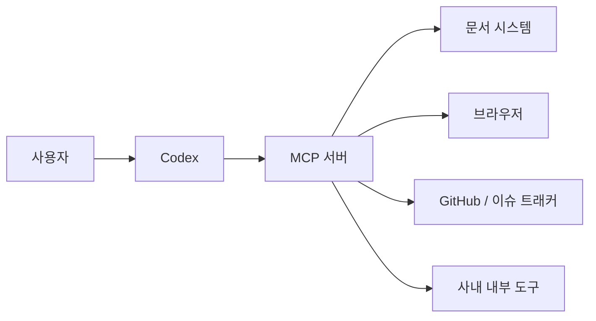

## 목차

1. MCP가 필요한 이유
2. 문서, 브라우저, 디자인 도구 연결
3. 사내 도구와 연결할 때의 사고방식
4. 컨텍스트를 도구로 제공하는 구조
5. 연결 전후 차이 예시
6. 도입 체크리스트
정리

에이전트 활용이 깊어질수록 하나의 한계가 보입니다. 필요한 정보가 코드베이스 밖에 있다는 점입니다. 문서 시스템, 디자인 도구, 브라우저, 이슈 트래커, 사내 지식 베이스가 연결되지 않으면 Codex는 항상 불완전한 컨텍스트에서 일하게 됩니다. MCP는 이 간극을 줄이는 구조입니다.

## 1. MCP가 필요한 이유

MCP의 핵심 가치는 "컨텍스트를 텍스트로 복붙하지 않아도 된다"는 데 있습니다. 더 정확하게 말하면, 컨텍스트를 문서 덩어리가 아니라 도구 접근 형태로 제공할 수 있게 해줍니다.

이 방식이 중요한 이유는 정보가 계속 바뀌기 때문입니다. 문서를 복사해 프롬프트에 붙여넣는 방식은 금방 낡고, 길이만 늘립니다. 반면 도구 연결은 필요한 순간에 필요한 정보만 가져오게 해줍니다.

## 2. 문서, 브라우저, 디자인 도구 연결

실무에서 흔히 연결 가치가 높은 대상은 다음과 같습니다.

- 사내 문서 시스템
- 웹 브라우저 또는 검색 도구
- 디자인 시스템과 화면 설계 도구
- GitHub, 이슈 트래커, 캘린더 같은 협업 도구

중요한 점은 도구를 많이 붙이는 것이 아니라, 실제 업무 흐름에서 자주 참조하는 맥락을 우선 연결하는 것입니다.

## 3. 사내 도구와 연결할 때의 사고방식

사내 도구를 연결할 때는 단순히 API를 노출하는 것보다 "어떤 질문을 자주 하는가"를 먼저 봐야 합니다. 예를 들어 운영 대시보드, 실험 메타데이터, 배치 상태, 데이터 카탈로그처럼 사람들이 반복적으로 찾는 정보가 좋은 후보입니다.

즉, MCP 설계는 기술 연결보다 질의 설계에 가깝습니다. 사람들이 어떤 맥락을 꺼내고 싶어 하는지 알아야 도구 인터페이스도 자연스럽게 설계됩니다.

## 4. 컨텍스트를 도구로 제공하는 구조

컨텍스트를 도구로 제공한다는 말은, 정적인 설명 대신 질의 가능한 인터페이스를 제공한다는 뜻입니다. 이것은 매우 중요한 전환입니다.

- 정적 컨텍스트: 길고 낡기 쉬움
- 도구 컨텍스트: 필요할 때 조회 가능하고 최신성을 유지하기 쉬움

에이전트 품질은 입력 텍스트 길이보다, 필요한 정보를 얼마나 적절한 순간에 가져올 수 있느냐에 더 크게 좌우됩니다.

## 5. 연결 전후 차이 예시

예를 들어 위키 문서를 매번 복사해 붙여넣는 방식과 MCP로 연결한 방식을 비교해보면 차이가 분명합니다.

- 연결 전: 문서 일부를 프롬프트에 붙여넣고, 누락이나 최신성 문제를 사람이 떠안습니다.
- 연결 후: 필요한 문서나 객체를 그때 조회하고, 최신 상태를 바탕으로 답변과 작업을 이어갑니다.

실무에서 이 차이는 특히 운영 문서, API 명세, 디자인 가이드처럼 자주 바뀌는 자산에서 크게 드러납니다. 텍스트 길이를 줄여주는 것이 핵심이 아니라, 최신 컨텍스트를 질의 가능한 상태로 바꾸는 것이 핵심입니다.

## 6. 도입 체크리스트

- 사람들이 반복적으로 찾는 외부 맥락이 무엇인지 정리했습니다.
- 정적 복붙보다 도구 조회가 더 적합한 대상을 골랐습니다.
- 최신성이 중요한 데이터와 아닌 데이터를 구분했습니다.
- 인증, 권한, 감사 로그 요구사항을 함께 검토했습니다.

## 정리

MCP는 Codex의 지능을 바꾸는 기술이 아니라, Codex가 접근할 수 있는 세계를 넓히는 기술입니다. 실제 업무에서 효과가 큰 이유도 여기에 있습니다. 더 많은 텍스트를 주는 것이 아니라, 더 좋은 맥락 구조를 주는 것이기 때문입니다.
